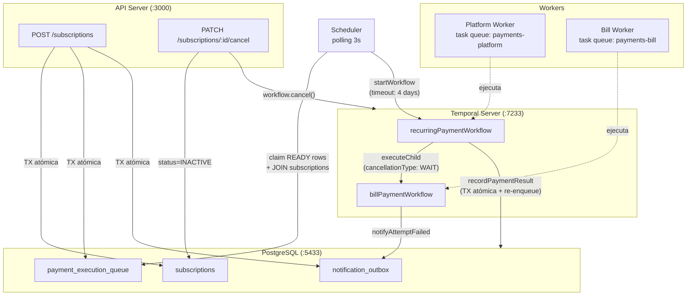
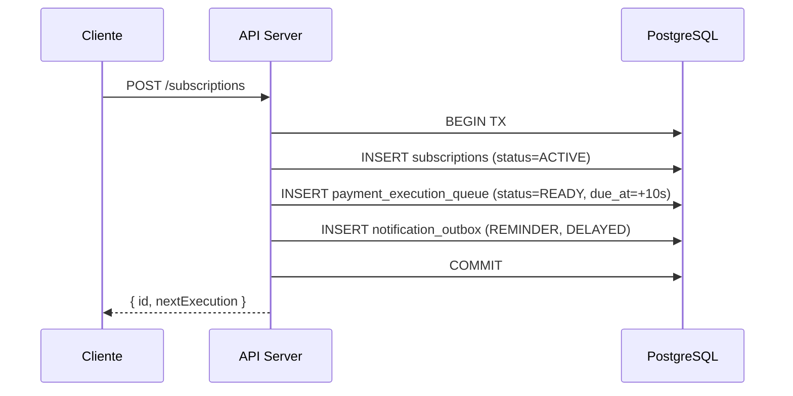
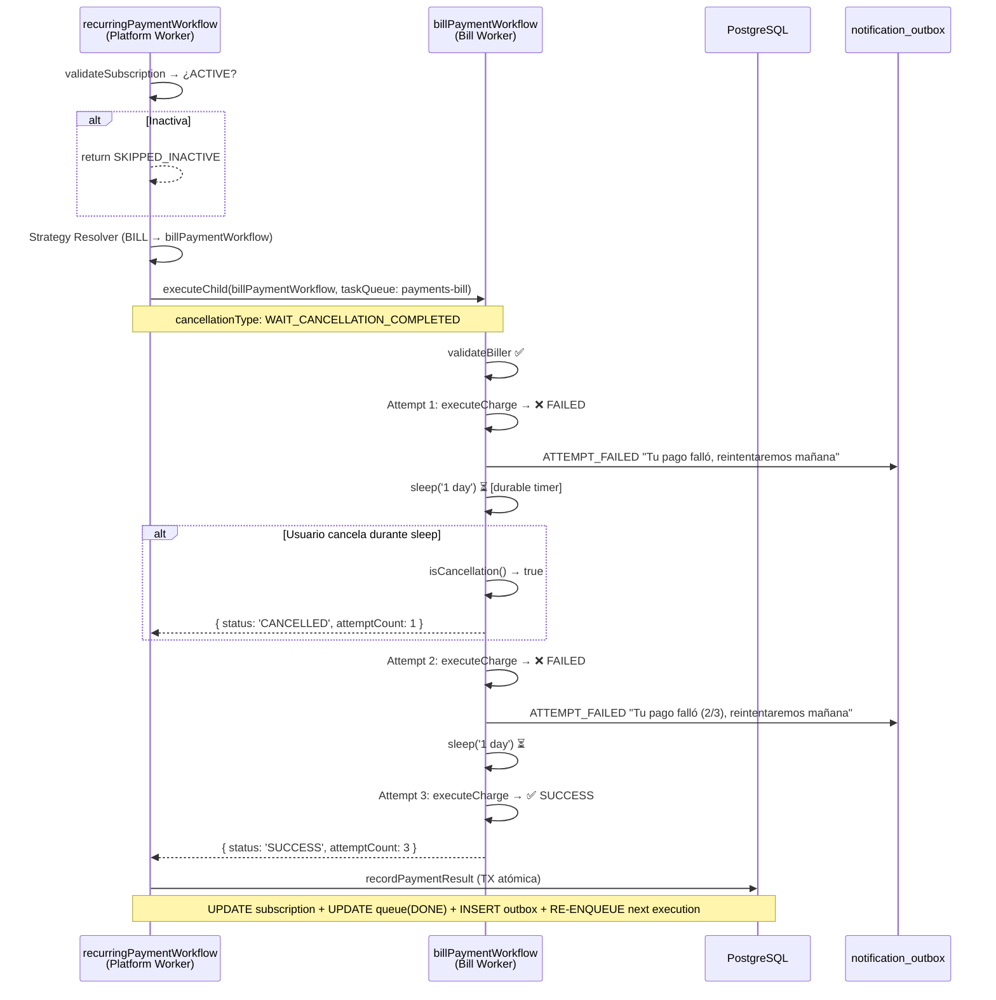
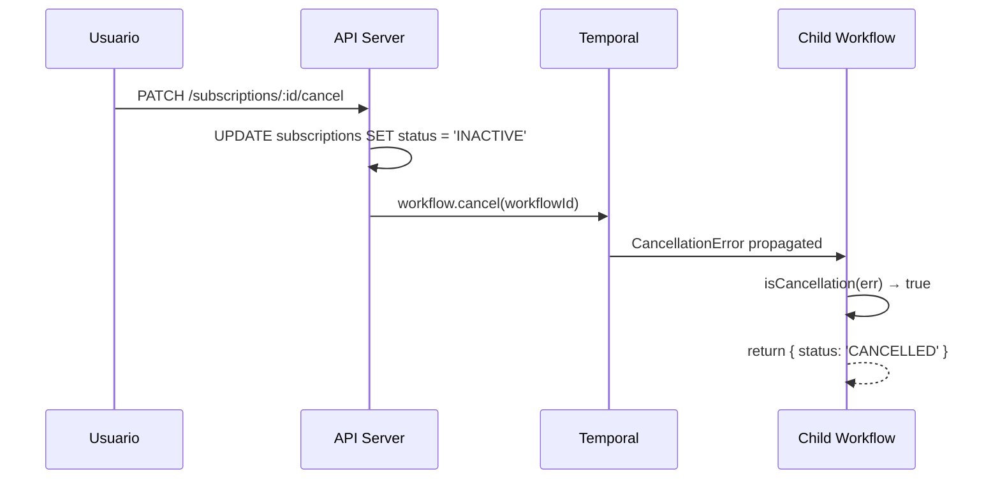
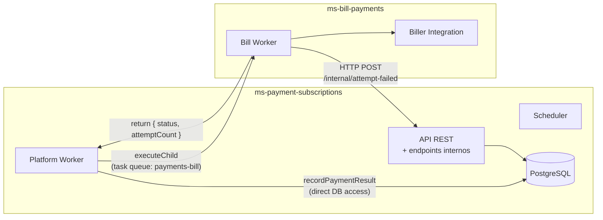

# PoC — PAD 213: Generalized Recurring Payments with Temporal

Proof of Concept que valida la arquitectura de pagos recurrentes automatizados usando **Temporal** como orquestador de workflows.

---

## Arquitectura General



---

## Flujo de Ejecución Detallado

### 1. Creación de Subscription (API)



### 2. Scheduler → Temporal

El scheduler hace polling cada 3 segundos buscando ejecuciones pendientes:

```sql
-- Claim rows atómicamente (JOIN con subscriptions para datos reales)
UPDATE payment_execution_queue
SET status = 'PROCESSING', locked_at = now(), locked_by = 'scheduler-1'
WHERE id IN (
  SELECT id FROM payment_execution_queue
  WHERE status = 'READY' AND due_at <= now()
  LIMIT 10
)
RETURNING *;

-- Luego: SELECT destination_id, amount, max_retries FROM subscriptions WHERE id = ANY(...)
```

Por cada row, inicia un `recurringPaymentWorkflow` en Temporal con:
- **Workflow ID determinístico** (`recurring-{sub_id}-{date}`) → evita duplicados
- **Datos reales** de la subscription (amount, destinationId, maxRetries)
- **Execution timeout** de 4 días (3 retries × 1 día + buffer)

El scheduler también ejecuta **recovery automático**: si hay rows en PROCESSING por más de 5 minutos (scheduler crash), las libera a READY.

### 3. Parent Workflow → Child Workflow (con reintentos y cancelación)



### 4. Re-encolamiento (Truly Recurring)

Cuando un pago es exitoso, `recordPaymentResult` ejecuta en una **TX atómica**:
1. Avanza `next_execution_at` (+1 día)
2. Reset `retry_count = 0`
3. Marca queue actual como DONE
4. **Inserta nuevo row en queue** (READY, due_at = next_execution_at)
5. Escribe PAYMENT_SUCCEEDED en outbox

Esto garantiza que la subscription se ejecute indefinidamente hasta que sea cancelada.

### 5. Cuatro resultados posibles del workflow

| Resultado | Descripción | Efecto en BD |
|-----------|-------------|--------------|
| `SUCCESS` | Cobro exitoso (en cualquier intento) | queue→DONE, outbox→PAYMENT_SUCCEEDED, **re-enqueue next day** |
| `FAILED` | Agotó todos los reintentos (max_retries) | queue→FAILED, outbox→PAYMENT_FAILED, **scheduleRetry** |
| `CANCELLED` | Usuario canceló durante un retry sleep | queue→FAILED (vía parent), status→INACTIVE |
| `SKIPPED_INACTIVE` | Subscription ya estaba inactiva | Sin cambios en BD |

### 6. Suspensión por reintentos agotados

Cuando el child workflow agota todos los intentos y el parent llama `scheduleRetry`:
- Si `retry_count + 1 >= max_retries` → **SUSPENDE** la subscription (status=SUSPENDED)
- Si no → incrementa `retry_count` (el próximo ciclo puede reintentar)

### 7. Cancelación en vuelo



El `sleep()` de Temporal es **cancellation-aware**: cuando se cancela el workflow, el timer se interrumpe inmediatamente y el child retorna `CANCELLED`.

---

## Patrones Arquitectónicos Validados

| Patrón | Implementación |
|--------|---------------|
| **Strategy Pattern** | El parent workflow resuelve `subscription_type` → child workflow + task queue |
| **Transactional Outbox** | Notificaciones se escriben en la misma TX que el resultado del pago |
| **Idempotency** | Workflow IDs determinísticos (`{sub_id}-{date}-{type}`) evitan duplicados |
| **Durable Timers** | `sleep('1 day')` en Temporal sobrevive crashes y reinicios |
| **Separation of Concerns** | Task queues separadas por dominio (platform vs bill) |
| **Retry con notificación** | Cada fallo intermedio notifica al usuario vía outbox antes del retry |
| **Re-encolamiento atómico** | Próxima ejecución se inserta en la misma TX que el resultado |
| **Cancellation-aware** | Child workflow detecta cancelación con `isCancellation()` y termina limpiamente |
| **Configurable retries** | `max_retries` se lee de BD, no hardcodeado en el workflow |
| **Scheduler recovery** | Rows stuck en PROCESSING >5 min se liberan automáticamente |
| **Workflow timeout** | `workflowExecutionTimeout: '4 days'` previene workflows zombie |
| **Suspension** | Subscription se suspende tras agotar max_retries definitivamente |

---

## Prerequisitos

- **Docker** (para PostgreSQL)
- **Node.js 18+**
- **Temporal CLI** (`brew install temporal`)

---

## Quick Start

```bash
# 1. Instalar dependencias
npm install

# 2. Levantar PostgreSQL
docker-compose up -d

# 3. Levantar Temporal (en una terminal separada)
temporal server start-dev --ui-port 8233 --db-filename temporal_poc.db

# 4. Crear schema de BD
npm run db:setup

# 5. Levantar workers y servicios (cada uno en una terminal)
npm run start:worker:platform   # Terminal 1 — Platform Worker
npm run start:worker:bill       # Terminal 2 — Bill Worker
npm run start:scheduler         # Terminal 3 — Scheduler (polling)
npm run start:api               # Terminal 4 — API REST

# 6. Crear subscripciones de prueba
npm run test:create
```

---

## API — Endpoints y Curls

### Crear una subscription

```bash
curl -X POST http://localhost:3000/subscriptions \
  -H "Content-Type: application/json" \
  -d '{
    "userId": "user-001",
    "subscriptionType": "BILL",
    "destinationId": "biller-electricity",
    "amount": 120.50,
    "frequency": "DAILY"
  }'
```

Respuesta:
```json
{
  "id": "43a05e07-a7cc-4f5a-b774-fb512457a14b",
  "nextExecution": "2026-07-08T19:28:39.546Z"
}
```

### Cancelar una subscription

```bash
curl -X PATCH http://localhost:3000/subscriptions/43a05e07-a7cc-4f5a-b774-fb512457a14b/cancel
```

Respuesta:
```json
{
  "id": "43a05e07-a7cc-4f5a-b774-fb512457a14b",
  "status": "INACTIVE",
  "message": "Subscription cancelled"
}
```

> **Nota:** Si hay un workflow en ejecución (ej: en sleep de retry), se cancela inmediatamente vía Temporal.

### Listar subscripciones

```bash
curl http://localhost:3000/subscriptions | jq
```

### Ver cola de ejecución

```bash
curl http://localhost:3000/queue | jq
```

### Ver outbox de notificaciones

```bash
curl http://localhost:3000/outbox | jq
```

---

## Verificar que Funciona

### Test básico (happy path + retry + re-enqueue)

```bash
# 1. Crear subscription
curl -s -X POST http://localhost:3000/subscriptions \
  -H "Content-Type: application/json" \
  -d '{"userId":"user-001","subscriptionType":"BILL","destinationId":"biller-electricity","amount":120.50}' | jq .

# 2. Esperar ~15 seg y verificar:
curl -s http://localhost:3000/outbox | jq '.[].event_type'
# Debería mostrar: "PAYMENT_SUCCEEDED" (o "ATTEMPT_FAILED" + retry)

# 3. Verificar re-encolamiento:
curl -s http://localhost:3000/queue | jq '.[] | {status, due_at}'
# Debería mostrar: DONE (hoy) + READY (mañana)
```

### Test de cancelación en vuelo

```bash
# 1. Crear subscription (ejecuta en 10 seg)
RESPONSE=$(curl -s -X POST http://localhost:3000/subscriptions \
  -H "Content-Type: application/json" \
  -d '{"subscriptionType":"BILL","destinationId":"biller-test","amount":100}')
SUB_ID=$(echo $RESPONSE | jq -r '.id')

# 2. Esperar a que falle el primer intento (~15 seg)
# 3. Cancelar mientras está en sleep de retry:
curl -s -X PATCH http://localhost:3000/subscriptions/$SUB_ID/cancel | jq .

# 4. Verificar en logs: "[BillPayment] 🚫 Cancelled during attempt 1"
```

### Temporal UI

Navega a http://localhost:8233 para ver:
- Historial completo de cada workflow
- Timers activos (sleep entre reintentos)
- Child workflows y su relación con el parent
- Workflows cancelados

---

## Estructura del Proyecto

```
src/
├── api/
│   └── server.ts              # Express API — CRUD subscriptions + cancel
├── activities/
│   └── index.ts               # Activities: validateSubscription, recordPaymentResult,
│                              #   scheduleRetry, notifyAttemptFailed, validateBiller, executeCharge
├── db/
│   ├── pool.ts                # Conexión a PostgreSQL
│   ├── schema.sql             # DDL: subscriptions, payment_execution_queue, notification_outbox
│   └── setup.ts               # Script para crear el schema
├── scheduler/
│   └── dispatcher.ts          # Poller: claim queue rows → start workflows + recovery
├── scripts/
│   └── create-subscription.ts # Script para crear subscripciones de prueba
├── workers/
│   ├── platform.worker.ts     # Worker: task queue 'payments-platform'
│   └── bill.worker.ts         # Worker: task queue 'payments-bill'
└── workflows/
    ├── index.ts               # Exports de workflows
    ├── recurring-payment.workflow.ts  # Parent: validate → strategy → child → record → re-enqueue
    └── bill-payment.workflow.ts       # Child: validate biller → charge con reintentos + cancellation
```

---

## Modelo de Datos

### `subscriptions`
Estado de la suscripción recurrente del usuario.

| Campo | Tipo | Descripción |
|-------|------|-------------|
| id | UUID | PK |
| user_id | TEXT | Usuario dueño |
| subscription_type | TEXT | BILL, P2P, etc. (determina el child workflow) |
| status | TEXT | ACTIVE / INACTIVE / SUSPENDED |
| destination_id | TEXT | Identificador del biller |
| amount | NUMERIC | Monto a cobrar |
| next_execution_at | TIMESTAMPTZ | Próxima ejecución programada |
| retry_count | INT | Reintentos acumulados (se resetea en SUCCESS) |
| max_retries | INT | Máximo de reintentos antes de SUSPENDED (default: 3) |

### `payment_execution_queue`
Cola de ejecuciones pendientes. El scheduler consume de aquí.

| Campo | Tipo | Descripción |
|-------|------|-------------|
| id | UUID | PK |
| subscription_id | UUID | FK → subscriptions |
| status | TEXT | READY → PROCESSING → DONE/FAILED |
| due_at | TIMESTAMPTZ | Cuándo debe ejecutarse |
| workflow_id | TEXT | ID del workflow en Temporal |
| locked_at | TIMESTAMPTZ | Timestamp del lock (para recovery >5min) |
| locked_by | TEXT | Scheduler que lo reclamó |

### `notification_outbox`
Transactional outbox para notificaciones al usuario.

| Campo | Tipo | Descripción |
|-------|------|-------------|
| id | UUID | PK |
| subscription_id | UUID | FK → subscriptions |
| event_type | TEXT | ATTEMPT_FAILED, PAYMENT_SUCCEEDED, PAYMENT_FAILED, REMINDER |
| delivery_class | TEXT | IMMEDIATE / DELAYED |
| payload | JSONB | Datos del evento (incluye attemptCount) |
| idempotency_key | TEXT | UNIQUE — evita duplicados |
| status | TEXT | PENDING → PUBLISHED |

---

## Configuración

| Servicio | Puerto | Notas |
|----------|--------|-------|
| PostgreSQL | 5433 | user: `poc`, password: `poc123`, db: `poc_recurring` |
| Temporal gRPC | 7233 | Servidor Temporal |
| Temporal UI | 8233 | http://localhost:8233 |
| API REST | 3000 | http://localhost:3000 |

---

## Notas de Producción vs PoC

| Aspecto | PoC | Producción |
|---------|-----|-----------|
| Retry delay | 1 minuto | 1 día |
| executeCharge | Simulado (80% éxito) | Integración real con biller |
| Scheduler | Polling simple + recovery | SKIP LOCKED + múltiples instancias + partitioning |
| Outbox consumer | No implementado | Kafka/SQS consumer que publica eventos |
| Auth | Sin autenticación | JWT / API Gateway |
| Observabilidad | Console.log | OpenTelemetry + Datadog |
| Cancelación | Via workflow ID del día | Via Search Attributes (buscar workflows activos por sub_id) |
| max_retries | Configurable por subscription | Configurable por tipo + overrides por usuario |
| Servicios | Monolito (todo en un proceso) | Microservicios separados por dominio |

---

## Comunicación entre Servicios

En producción, el **child workflow** vive en un servicio diferente al platform. La regla es:

> **Solo el servicio dueño de la BD escribe en ella.** Los child workflows usan la API interna del platform para efectos colaterales.



### Endpoints internos (`/internal/*`)

Estos endpoints son llamados por los child workflows en otros servicios:

| Método | Endpoint | Propósito |
|--------|----------|-----------|
| POST | `/internal/attempt-failed` | Notificar un intento fallido (escribe a outbox) |

```bash
# Ejemplo: child workflow notifica un fallo
curl -X POST http://ms-payment-subscriptions/internal/attempt-failed \
  -H "Content-Type: application/json" \
  -d '{
    "subscriptionId": "43a05e07-...",
    "attempt": 1,
    "maxAttempts": 3,
    "nextRetryIn": "1 day"
  }'
```

### Responsabilidades por servicio

| Servicio | Responsabilidad | Acceso a BD |
|----------|----------------|-------------|
| **ms-payment-subscriptions** | Orquestación, scheduling, state management, outbox | ✅ Directo |
| **ms-bill-payments** | Validar biller, ejecutar cobro, notificar fallos via API | ❌ Solo via HTTP |
| **ms-p2p-payments** (futuro) | Ejecutar transferencia P2P | ❌ Solo via HTTP |

### ¿Por qué este patrón?

1. **Ownership de datos** — Solo un servicio modifica su BD (evita distributed transactions)
2. **Contrato explícito** — Los endpoints internos definen qué puede hacer un child
3. **Independencia de deploy** — El child no necesita conocer el schema de la BD
4. **Testability** — En tests del child, mockeas HTTP; no necesitas BD del platform

---

## Decisiones Arquitectónicas Abiertas

### 1. ¿Un workflow por ejecución o un workflow de larga duración?

| Opción | Descripción | Trade-off |
|--------|-------------|-----------|
| **A) Workflow por ejecución** ✅ (esta PoC) | Scheduler encola → Temporal ejecuta → termina | Simple, versionable, visible en BD |
| **B) Workflow de larga duración** | Un `while(true)` con `sleep('1 day')` por subscription | No necesita scheduler, pero difícil de versionar con 500K workflows dormidos |

### 2. ¿Dónde viven los reintentos?

| Opción | Descripción | Recomendación |
|--------|-------------|---------------|
| **A) Sleep en el child workflow** ✅ (esta PoC) | El child maneja N intentos con durable timers | Ideal para BILL (reintentos son parte del ciclo de cobro) |
| **B) Re-enqueue externo** | Child falla → parent marca FAILED → scheduler re-encola para mañana | Ideal para P2P/TopUp (usuario decide si reintenta) |

Se pueden combinar: retry rápido en child (horas) + re-enqueue externo (días).

### 3. ¿Outbox consumer como Temporal worker o Kafka consumer?

| Opción | Descripción | Recomendación |
|--------|-------------|---------------|
| **A) Kafka consumer** ✅ | CDC/polling → Kafka → múltiples consumers (email, push, analytics) | Estándar, desacoplado, replay |
| **B) Temporal worker** | Otro workflow que hace polling a la outbox | Más simple pero acopla dominios |

### 4. ¿Temporal namespace compartido o dedicado?

**Recomendación:** Namespace dedicado `payments-recurring`. Aislamiento de recursos, retención de historial independiente, permisos separados.

### 5. ¿Cómo escala el scheduler?

| Opción | Descripción |
|--------|-------------|
| **A) Proceso standalone + SKIP LOCKED** | Múltiples instancias del scheduler pueden correr en paralelo sin duplicar trabajo |
| **B) Temporal Schedules** | Feature nativo de Temporal para scheduling (evaluar si soporta batching) |
| **C) Kubernetes CronJob** | Familiar, pero menos control |
