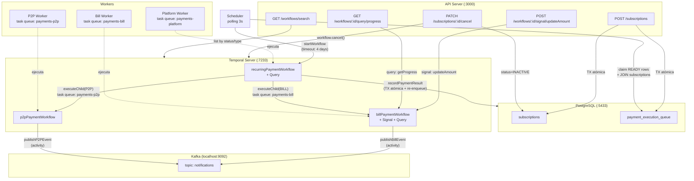
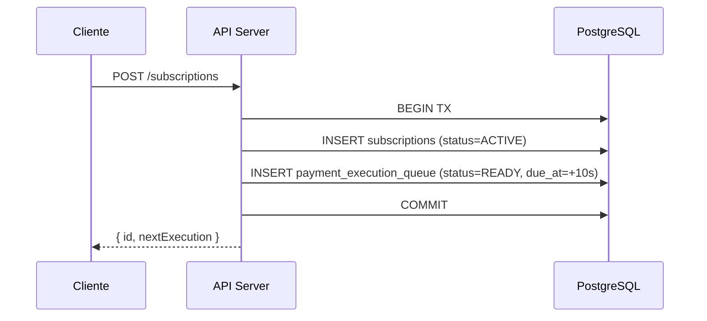
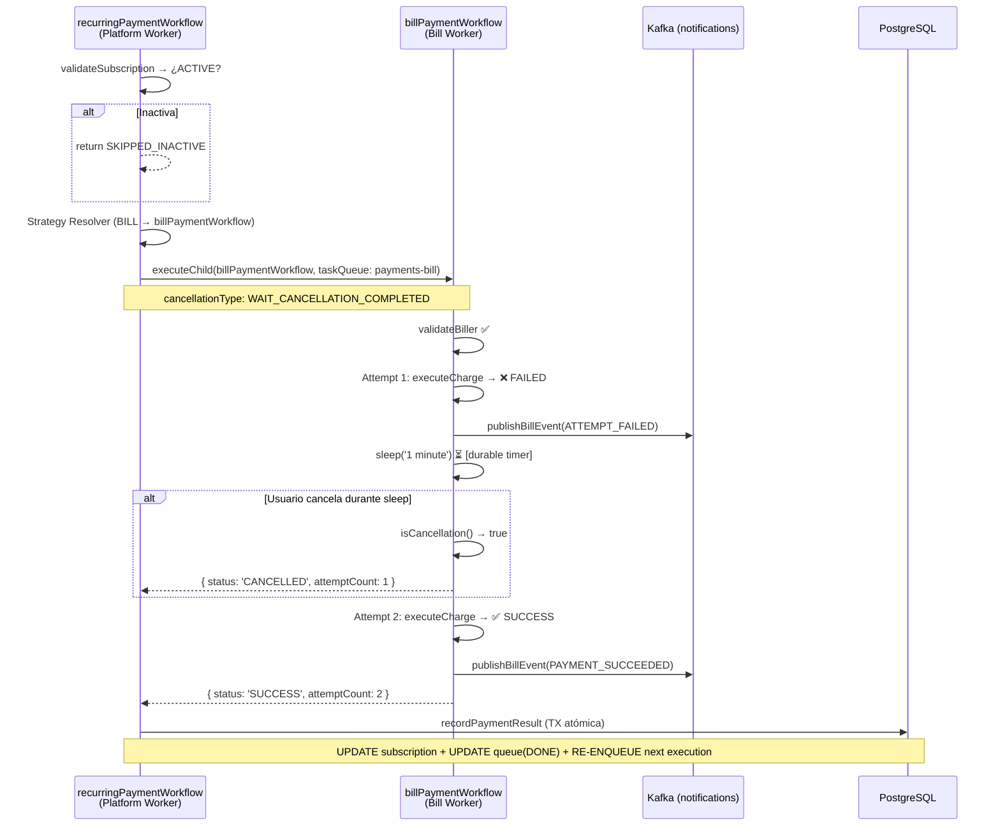
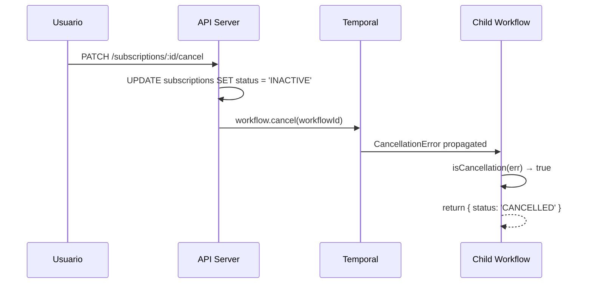
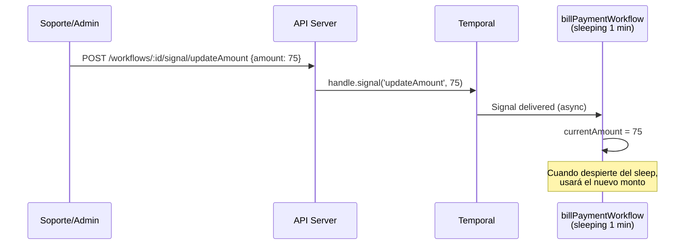
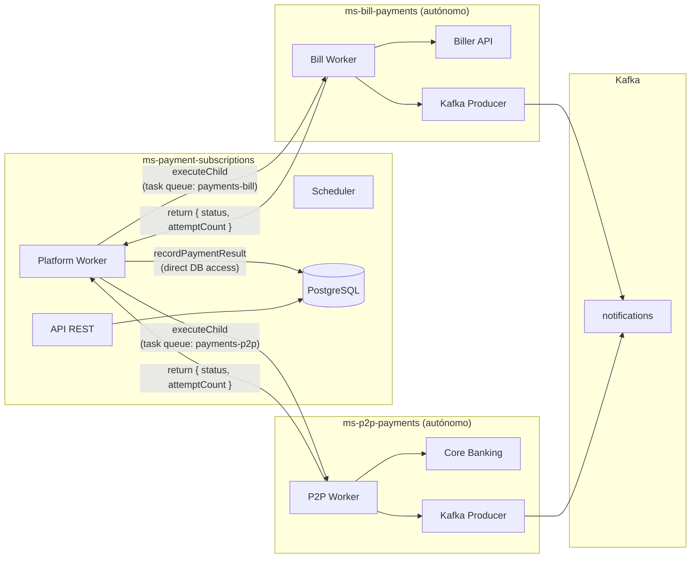

# PoC — PAD 213: Generalized Recurring Payments with Temporal

Proof of Concept que valida la arquitectura de pagos recurrentes automatizados usando **Temporal** como orquestador de workflows.

### ¿Qué problema resuelve?

En Yape tenemos múltiples tipos de pagos recurrentes (servicios, P2P, top-ups) que hoy se ejecutan con cron jobs aislados. Esta PoC valida una **arquitectura unificada** que:

- Orquesta pagos con reintentos durables (sobreviven crashes)
- Escala cada tipo de pago de forma independiente
- Cada dominio notifica al usuario directamente (via Kafka)
- Permite cancelar un cobro en curso inmediatamente
- Re-encola la siguiente ejecución de forma atómica

**Audiencia:** Equipo de desarrollo de Yape — para validar patrones antes de implementar en producción.

## Tabla de Contenidos

- [Arquitectura General](#arquitectura-general)
- [Principio Arquitectónico Clave](#principio-arquitectónico-clave)
- [Flujo de Ejecución Detallado](#flujo-de-ejecución-detallado)
- [Patrones Arquitectónicos Validados](#patrones-arquitectónicos-validados)
- [Quick Start](#quick-start)
- [Verificar que Funciona](#verificar-que-funciona)
- [API — Endpoints y Curls](#api--endpoints-y-curls)
- [Estructura del Proyecto](#estructura-del-proyecto)
- [Modelo de Datos](#modelo-de-datos)
- [Configuración](#configuración)
- [Signals y Queries](#signals-y-queries)
- [Kafka — Eventos de Notificación](#kafka--eventos-de-notificación)
- [Comunicación entre Servicios](#comunicación-entre-servicios)
- [Notas de Producción vs PoC](#notas-de-producción-vs-poc)
- [Decisiones Arquitectónicas Abiertas](#decisiones-arquitectónicas-abiertas)
- [Troubleshooting](#troubleshooting)

---

## Arquitectura General



---

## Principio Arquitectónico Clave

> **Platform = Scheduling Engine. Domains = Ejecución + Notificaciones.**

```mermaid
flowchart LR
    subgraph PLATFORM["Platform (ms-payment-subscriptions)"]
        direction TB
        P1[Subscription Lifecycle]
        P2[Execution Queue]
        P3[Scheduler / Dispatcher]
        P4[RecurringPaymentWorkflow]
        P5[Strategy Resolver]
    end

    subgraph BILL_DOMAIN["Bill Domain (autónomo)"]
        direction TB
        B1[billPaymentWorkflow]
        B2[validateBiller]
        B3[executeCharge]
        B4[publishBillEvent → Kafka]
    end

    subgraph P2P_DOMAIN["P2P Domain (autónomo)"]
        direction TB
        D1[p2pPaymentWorkflow]
        D2[validateP2PRecipient]
        D3[executeP2PTransfer]
        D4[publishP2PEvent → Kafka]
    end

    PLATFORM -->|"executeChild"| BILL_DOMAIN
    PLATFORM -->|"executeChild"| P2P_DOMAIN
    BILL_DOMAIN -->|"result"| PLATFORM
    P2P_DOMAIN -->|"result"| PLATFORM
```



**¿Por qué este diseño?**

| Responsabilidad | Dueño | Razón |
|---|---|---|
| Cuándo cobrar (scheduling) | Platform | Es lógica transversal a todos los tipos |
| Cómo cobrar (ejecución) | Cada dominio | Cada biller/wallet tiene su lógica |
| Qué notificar al usuario | Cada dominio | Cada dominio conoce mejor su UX de notificación |
| Estado de la suscripción | Platform | Es lifecycle management centralizado |

**Beneficios:**
- Los child workflows son **100% autónomos** — no dependen de la API de platform
- Cada equipo controla su flujo de notificaciones (mensaje, timing, canal)
- Platform no tiene outbox ni publisher — es puramente orquestación
- Agregar un nuevo tipo de pago = nuevo child workflow + nueva entry en Strategy Resolver

---

## Flujo de Ejecución Detallado

### 1. Creación de Subscription (API)



### 2. Scheduler → Temporal

El scheduler hace polling cada 3 segundos buscando ejecuciones pendientes:

```sql
-- Claim rows atómicamente (JOIN con subscriptions para datos reales)
UPDATE payment_execution_queue
SET status = 'PROCESSING', locked_at = now(), locked_by = 'scheduler-1'
WHERE id IN (
  SELECT id FROM payment_execution_queue
  WHERE status = 'READY' AND due_at <= now()
  LIMIT 10
)
RETURNING *;

-- Luego: SELECT destination_id, amount, max_retries FROM subscriptions WHERE id = ANY(...)
```

Por cada row, inicia un `recurringPaymentWorkflow` en Temporal con:
- **Workflow ID determinístico** (`recurring-{sub_id}-{date}`) → evita duplicados
- **Datos reales** de la subscription (amount, destinationId, maxRetries)
- **Execution timeout** de 4 días (3 retries × 1 día + buffer)

El scheduler también ejecuta **recovery automático**: si hay rows en PROCESSING por más de 5 minutos (scheduler crash), las libera a READY.

### 3. Parent Workflow → Child Workflow (con notificaciones directas a Kafka)



### 4. Re-encolamiento (Truly Recurring)

Cuando un pago es exitoso, `recordPaymentResult` ejecuta en una **TX atómica**:
1. Avanza `next_execution_at` (+1 día)
2. Reset `retry_count = 0`
3. Marca queue actual como DONE
4. **Inserta nuevo row en queue** (READY, due_at = next_execution_at)

Esto garantiza que la subscription se ejecute indefinidamente hasta que sea cancelada.

### 5. Cuatro resultados posibles del workflow

| Resultado | Descripción | Efecto en BD |
|-----------|-------------|--------------|
| `SUCCESS` | Cobro exitoso (en cualquier intento) | queue→DONE, **re-enqueue next day** |
| `FAILED` | Agotó todos los reintentos (max_retries) | queue→FAILED, **scheduleRetry** |
| `CANCELLED` | Usuario canceló durante un retry sleep | queue→FAILED (vía parent), status→INACTIVE |
| `SKIPPED_INACTIVE` | Subscription ya estaba inactiva | Sin cambios en BD |

### 6. Suspensión por reintentos agotados

Cuando el child workflow agota todos los intentos y el parent llama `scheduleRetry`:
- Si `retry_count + 1 >= max_retries` → **SUSPENDE** la subscription (status=SUSPENDED)
- Si no → incrementa `retry_count` (el próximo ciclo puede reintentar)

### 7. Cancelación en vuelo



El `sleep()` de Temporal es **cancellation-aware**: cuando se cancela el workflow, el timer se interrumpe inmediatamente y el child retorna `CANCELLED`.

---

## Patrones Arquitectónicos Validados

| Patrón | Implementación |
|--------|---------------|
| **Strategy Pattern** | El parent workflow resuelve `subscription_type` → child workflow + task queue |
| **Domain-owned notifications** | Cada child publica sus eventos directamente a Kafka (sin outbox centralizado) |
| **Idempotency** | Workflow IDs determinísticos (`{sub_id}-{date}-{type}`) evitan duplicados |
| **Durable Timers** | `sleep('1 day')` en Temporal sobrevive crashes y reinicios |
| **Separation of Concerns** | Platform = scheduling. Domains = ejecución + notificaciones |
| **Task Queue isolation** | Cada dominio escala independientemente (payments-bill, payments-p2p) |
| **Re-encolamiento atómico** | Próxima ejecución se inserta en la misma TX que el resultado |
| **Cancellation-aware** | Child workflow detecta cancelación con `isCancellation()` y termina limpiamente |
| **Configurable retries** | `max_retries` se lee de BD, no hardcodeado en el workflow |
| **Signals** | `updateAmount` permite cambiar el monto de cobro mientras el workflow está en retry-sleep |
| **Queries** | `getProgress` inspecciona el estado del child sin bloquearlo (attempt, amount, status) |
| **Workflow search** | Buscar workflows por tipo y estado via API y Temporal CLI |
| **Multi-strategy children** | BILL (cobro a biller) y P2P (transferencia wallet-to-wallet) como workflows separados |
| **Scheduler recovery** | Rows stuck en PROCESSING >5 min se liberan automáticamente |
| **Workflow timeout** | `workflowExecutionTimeout: '4 days'` previene workflows zombie |
| **Suspension** | Subscription se suspende tras agotar max_retries definitivamente |

---

## Prerequisitos

- **Docker** (para PostgreSQL)
- **Node.js 18+**
- **Temporal CLI** (`brew install temporal`)
- **Kafka** corriendo en `localhost:9092` con tópico `notifications`

---

## Quick Start

```bash
# 1. Instalar dependencias
npm install

# 2. Levantar PostgreSQL
docker-compose up -d

# 3. Levantar Temporal (en una terminal separada)
temporal server start-dev --ui-port 8233 --db-filename temporal_poc.db

# 4. Asegurarse que Kafka esté corriendo (localhost:9092, topic: notifications)

# 5. Crear schema de BD
npm run db:setup

# 6. Levantar workers y servicios (cada uno en una terminal)
npm run start:worker:platform   # Terminal 1 — Platform Worker (task queue: payments-platform)
npm run start:worker:bill       # Terminal 2 — Bill Worker (task queue: payments-bill) + Kafka
npm run start:worker:p2p        # Terminal 3 — P2P Worker (task queue: payments-p2p) + Kafka
npm run start:scheduler         # Terminal 4 — Scheduler (polling)
npm run start:api               # Terminal 5 — API REST

# 7. Crear subscripciones de prueba
npm run test:create
```

---

## Verificar que Funciona

### Flujo 1: Happy Path (cobro exitoso + re-enqueue)

```bash
# Crear subscription BILL
curl -s -X POST http://localhost:3000/subscriptions \
  -H "Content-Type: application/json" \
  -d '{"userId":"user-001","subscriptionType":"BILL","destinationId":"biller-claro","amount":89.90}' | jq .

# Esperar 15 segundos y verificar resultado
sleep 15

# ¿Se re-encoló para mañana? Debe mostrar un row READY con due_at de mañana
curl -s http://localhost:3000/queue | jq '.[] | {status, due_at}' | head -10
```

**Qué esperar:**
- En la terminal del Bill Worker: `[BillPayment] Attempt 1/3 → SUCCESS ✅`
- En la terminal del Bill Worker: `[Bill→Kafka] 📤 PAYMENT_SUCCEEDED | sub: ...`
- Si falló el primer intento (20% probabilidad): verás `ATTEMPT_FAILED` → Kafka + sleep 1 min + reintento
- En Kafka (topic notifications): mensaje con el evento

**Verificar en Kafka:**
```bash
kafka-console-consumer --bootstrap-server localhost:9092 --topic notifications --from-beginning
```

---

### Flujo 2: P2P (transferencia wallet-to-wallet)

```bash
# Crear subscription P2P
curl -s -X POST http://localhost:3000/subscriptions \
  -H "Content-Type: application/json" \
  -d '{"userId":"user-002","subscriptionType":"P2P","destinationId":"wallet-mama","amount":200.00}' | jq .

sleep 15
```

**Qué esperar:**
- Terminal P2P Worker: `[P2P] validateP2PRecipient → ACTIVE` + `executeP2PTransfer → SUCCESS`
- Terminal P2P Worker: `[P2P→Kafka] 📤 PAYMENT_SUCCEEDED | sub: ...`
- Terminal Bill Worker: **nada** (confirma que task queues están aisladas)

---

### Flujo 3: Cancelar mid-flight

```bash
# Crear subscription
SUB_ID=$(curl -s -X POST http://localhost:3000/subscriptions \
  -H "Content-Type: application/json" \
  -d '{"subscriptionType":"BILL","destinationId":"biller-test","amount":100}' | jq -r '.id')

echo "Subscription: $SUB_ID"

# Esperar a que arranque el workflow (12 seg)
sleep 12

# Cancelar
curl -s -X PATCH "http://localhost:3000/subscriptions/$SUB_ID/cancel" | jq .
```

**Qué esperar:**
- Si el workflow estaba en retry-sleep: Bill Worker muestra `🚫 Cancelled during attempt X`
- Si ya había terminado: responde "No active workflow to cancel" (idempotente)

---

### Flujo 4: Signal + Query (cambiar monto y consultar estado)

```bash
# Crear varias subscriptions (alguna fallará y entrará en retry-sleep)
for i in 1 2 3 4 5; do
  curl -s -X POST http://localhost:3000/subscriptions \
    -H "Content-Type: application/json" \
    -d "{\"userId\":\"user-signal\",\"subscriptionType\":\"BILL\",\"destinationId\":\"biller-$i\",\"amount\":$((i*20))}" > /dev/null
done
echo "Creadas 5 subscriptions"

sleep 15

# Buscar un workflow que esté en retry (Running)
curl -s "http://localhost:3000/workflows/search?status=Running" | jq '.workflows[0].workflowId'

# Si hay uno corriendo, usa su ID para:
# Query: ver en qué intento va
curl -s "http://localhost:3000/workflows/{WORKFLOW_ID}/query/progress" | jq .

# Signal: cambiar el monto a 1.00
curl -s -X POST "http://localhost:3000/workflows/{WORKFLOW_ID}/signal/updateAmount" \
  -H "Content-Type: application/json" \
  -d '{"amount": 1.00}' | jq .

# Query de nuevo: confirmar que cambió
curl -s "http://localhost:3000/workflows/{WORKFLOW_ID}/query/progress" | jq .
```

**Qué esperar:**
- Query muestra: `{ currentAttempt: 1, maxAttempts: 3, currentAmount: 50, status: "WAITING_RETRY" }`
- Después del signal: `currentAmount` cambia a `1.00`
- Cuando el timer expire, el Bill Worker cobrará con el nuevo monto

---

### Flujo 5: Buscar workflows

```bash
# Buscar por tipo de workflow
curl -s "http://localhost:3000/workflows/search?workflowType=billPaymentWorkflow" | jq '.count, .workflows[].workflowId'

# Buscar por estado
curl -s "http://localhost:3000/workflows/search?status=Running" | jq '.count'

# También desde Temporal CLI:
temporal workflow list -q 'WorkflowType="recurringPaymentWorkflow"'
temporal workflow list -q 'ExecutionStatus="Running"'
```

---

### Temporal UI

Abre http://localhost:8233 para ver:
- Historial completo de cada workflow (activities, timers, signals)
- Child workflows y su relación con el parent
- Workflows cancelados vs completados

---

## API — Endpoints y Curls

### Crear una subscription

```bash
curl -X POST http://localhost:3000/subscriptions \
  -H "Content-Type: application/json" \
  -d '{
    "userId": "user-001",
    "subscriptionType": "BILL",
    "destinationId": "biller-electricity",
    "amount": 120.50,
    "frequency": "DAILY"
  }'
```

Respuesta:
```json
{
  "id": "43a05e07-a7cc-4f5a-b774-fb512457a14b",
  "nextExecution": "2026-07-08T19:28:39.546Z"
}
```

### Cancelar una subscription

```bash
curl -X PATCH http://localhost:3000/subscriptions/43a05e07-a7cc-4f5a-b774-fb512457a14b/cancel
```

Respuesta:
```json
{
  "id": "43a05e07-a7cc-4f5a-b774-fb512457a14b",
  "status": "INACTIVE",
  "message": "Subscription cancelled"
}
```

> **Nota:** Si hay un workflow en ejecución (ej: en sleep de retry), se cancela inmediatamente vía Temporal.

### Listar subscripciones

```bash
curl http://localhost:3000/subscriptions | jq
```

### Ver cola de ejecución

```bash
curl http://localhost:3000/queue | jq
```

### Crear subscription P2P (transferencia entre wallets)

```bash
curl -X POST http://localhost:3000/subscriptions \
  -H "Content-Type: application/json" \
  -d '{
    "userId": "user-002",
    "subscriptionType": "P2P",
    "destinationId": "wallet-mama",
    "amount": 200.00,
    "frequency": "DAILY"
  }'
```

### Signal: Cambiar monto mid-flight

Cuando un workflow está en retry-sleep, puedes cambiar el monto que usará en el próximo intento:

```bash
# El workflowId del child es: {subscriptionId}-{date}-BILL
curl -X POST http://localhost:3000/workflows/{subscriptionId}-2026-07-08-BILL/signal/updateAmount \
  -H "Content-Type: application/json" \
  -d '{"amount": 75.00}'
```

### Query: Inspeccionar progreso del child workflow

```bash
# Ver en qué intento va, monto actual, y si está esperando retry
curl http://localhost:3000/workflows/{subscriptionId}-2026-07-08-BILL/query/progress | jq
```

Respuesta:
```json
{
  "currentAttempt": 2,
  "maxAttempts": 3,
  "currentAmount": 75.00,
  "status": "WAITING_RETRY",
  "lastAttemptResult": "FAILED"
}
```

### Query: Estado del parent workflow

```bash
curl http://localhost:3000/workflows/recurring-{subscriptionId}-2026-07-08/query/status | jq
```

### Search: Buscar workflows por tipo y estado

```bash
# Buscar por tipo de workflow
curl "http://localhost:3000/workflows/search?workflowType=billPaymentWorkflow" | jq

# Buscar por estado
curl "http://localhost:3000/workflows/search?status=Running" | jq

# También funciona directamente con Temporal CLI:
temporal workflow list -q 'WorkflowType="recurringPaymentWorkflow" AND ExecutionStatus="Running"'
```

---

## Estructura del Proyecto

```
src/
├── api/
│   └── server.ts              # Express API — CRUD + cancel + signals + queries + search
├── activities/
│   ├── index.ts               # Platform activities: validateSubscription, recordPaymentResult, scheduleRetry
│   ├── bill.activities.ts     # Bill domain: validateBiller, executeCharge, publishBillEvent (→ Kafka)
│   └── p2p.activities.ts      # P2P domain: validateP2PRecipient, executeP2PTransfer, publishP2PEvent (→ Kafka)
├── db/
│   ├── pool.ts                # Conexión a PostgreSQL
│   ├── schema.sql             # DDL: subscriptions, payment_execution_queue
│   └── setup.ts               # Script para crear el schema
├── kafka/
│   └── producer.ts            # Kafka producer (kafkajs) — conexión y publish helper
├── scheduler/
│   └── dispatcher.ts          # Poller: claim queue rows → start workflows + recovery
├── scripts/
│   └── create-subscription.ts # Script para crear subscripciones de prueba
├── workers/
│   ├── platform.worker.ts     # Worker: task queue 'payments-platform' (platform activities)
│   ├── bill.worker.ts         # Worker: task queue 'payments-bill' (bill activities + Kafka)
│   └── p2p.worker.ts          # Worker: task queue 'payments-p2p' (p2p activities + Kafka)
└── workflows/
    ├── index.ts               # Exports de workflows
    ├── recurring-payment.workflow.ts  # Parent: validate → strategy → child → record
    │                                  #   + Query: getExecutionStatus
    ├── bill-payment.workflow.ts       # Child BILL: charge con retries + Signal + Query + Kafka
    └── p2p-payment.workflow.ts        # Child P2P: wallet transfer con retries + Kafka
```

---

## Modelo de Datos

### `subscriptions`
Estado de la suscripción recurrente del usuario.

| Campo | Tipo | Descripción |
|-------|------|-------------|
| id | UUID | PK |
| user_id | TEXT | Usuario dueño |
| subscription_type | TEXT | BILL, P2P, etc. (determina el child workflow) |
| status | TEXT | ACTIVE / INACTIVE / SUSPENDED |
| destination_id | TEXT | Identificador del biller o wallet destino |
| amount | NUMERIC | Monto a cobrar |
| next_execution_at | TIMESTAMPTZ | Próxima ejecución programada |
| retry_count | INT | Reintentos acumulados (se resetea en SUCCESS) |
| max_retries | INT | Máximo de reintentos antes de SUSPENDED (default: 3) |

### `payment_execution_queue`
Cola de ejecuciones pendientes. El scheduler consume de aquí.

| Campo | Tipo | Descripción |
|-------|------|-------------|
| id | UUID | PK |
| subscription_id | UUID | FK → subscriptions |
| subscription_type | TEXT | Tipo para routing |
| status | TEXT | READY → PROCESSING → DONE/FAILED |
| due_at | TIMESTAMPTZ | Cuándo debe ejecutarse |
| workflow_id | TEXT | ID del workflow en Temporal |
| locked_at | TIMESTAMPTZ | Timestamp del lock (para recovery >5min) |
| locked_by | TEXT | Scheduler que lo reclamó |

> **Nota:** Ya no existe la tabla `notification_outbox`. Las notificaciones las publica cada dominio directamente a Kafka.

---

## Configuración

| Servicio | Puerto | Notas |
|----------|--------|-------|
| PostgreSQL | 5433 | user: `poc`, password: `poc123`, db: `poc_recurring` |
| Temporal gRPC | 7233 | Servidor Temporal |
| Temporal UI | 8233 | http://localhost:8233 |
| API REST | 3000 | http://localhost:3000 |
| Kafka | 9092 | Tópico: `notifications` |

### Variables de entorno opcionales

| Variable | Default | Descripción |
|----------|---------|-------------|
| `KAFKA_BROKER` | `localhost:9092` | Broker de Kafka |
| `KAFKA_TOPIC` | `notifications` | Tópico donde se publican los eventos |
| `PLATFORM_API_URL` | `http://localhost:3000` | URL del API server (no usado actualmente) |

---

## Signals y Queries

### Signals — Modificar workflows en ejecución

Los **Signals** permiten enviar datos a un workflow que está corriendo. El workflow los procesa de forma asíncrona:



**Caso de uso:** El usuario reporta que su factura cambió. Soporte ajusta el monto sin cancelar/recrear la subscription.

### Queries — Inspeccionar workflows sin modificarlos

Los **Queries** son lecturas sincrónicas del estado interno del workflow:

```bash
# ¿En qué intento va? ¿Cuánto va a cobrar?
curl http://localhost:3000/workflows/{wfId}/query/progress
# → { "currentAttempt": 2, "maxAttempts": 3, "currentAmount": 75, "status": "WAITING_RETRY" }
```

**Caso de uso:** Dashboard de ops muestra estado real-time de cada cobro sin consultar la BD.

---

## Kafka — Eventos de Notificación

Cada dominio publica sus eventos directamente al tópico `notifications` via una activity de Temporal.

### Estructura del mensaje

```json
{
  "domain": "bill",
  "subscriptionId": "uuid-de-la-suscripcion",
  "eventType": "PAYMENT_SUCCEEDED | PAYMENT_FAILED | ATTEMPT_FAILED",
  "payload": {
    "amount": 89.90,
    "attempt": 1,
    "destinationId": "biller-claro"
  },
  "publishedAt": "2026-07-09T14:00:01Z"
}
```

### Eventos por dominio

| Dominio | Evento | Cuándo se publica |
|---------|--------|-------------------|
| Bill | `PAYMENT_SUCCEEDED` | Cobro exitoso (en cualquier intento) |
| Bill | `PAYMENT_FAILED` | Biller inválido o agotó todos los reintentos |
| Bill | `ATTEMPT_FAILED` | Un intento falló, se reintentará |
| P2P | `PAYMENT_SUCCEEDED` | Transferencia exitosa |
| P2P | `PAYMENT_FAILED` | Recipient inválido o agotó reintentos |
| P2P | `ATTEMPT_FAILED` | Una transferencia falló, se reintentará |

### Key de particionado

`subscriptionId` — garantiza que todos los eventos de una misma suscripción lleguen a la misma partición (orden garantizado por suscripción).

### ¿Por qué activities y no outbox?

| Aspecto | Outbox (anterior) | Activity directa (actual) |
|---------|-------------------|--------------------------|
| Consistencia | Transaccional (mismo commit) | Eventual (Temporal garantiza ejecución) |
| Complejidad | Tabla + publisher + polling | Solo una activity |
| Acoplamiento | Domains dependen de Platform | Domains son autónomos |
| Retry | Publisher propio | Temporal retry policy |
| Duplicados | Idempotency key en BD | Temporal activity dedup (idempotente por workflow history) |

Temporal garantiza que si la activity `publishBillEvent` falla, se reintenta automáticamente. Si el workflow completa, la activity se ejecutó exitosamente.

---

## Comunicación entre Servicios

En esta arquitectura, los dominios son **completamente independientes** de Platform:



### Responsabilidades por servicio

| Servicio | Responsabilidad | Acceso a BD Platform | Publica a Kafka |
|----------|----------------|---------------------|-----------------|
| **ms-payment-subscriptions** | Scheduling, lifecycle, state management | ✅ Directo | ❌ No |
| **ms-bill-payments** | Validar biller, ejecutar cobro, notificar | ❌ No | ✅ Sí |
| **ms-p2p-payments** | Validar wallet, ejecutar transferencia, notificar | ❌ No | ✅ Sí |

### ¿Por qué este patrón?

1. **Autonomía total** — Cada dominio ejecuta y notifica sin depender de Platform
2. **Zero HTTP callbacks** — Los child workflows no llaman APIs externas para notificar
3. **Ownership de datos** — Solo Platform modifica su BD; solo cada dominio decide qué publicar
4. **Testability** — Testing del child no requiere mockear APIs ni BD externas
5. **Independencia de deploy** — Platform puede deployar sin afectar a Bill o P2P y viceversa

---

## Notas de Producción vs PoC

| Aspecto | PoC | Producción |
|---------|-----|-----------|
| Retry delay | 1 minuto | 1 día |
| executeCharge | Simulado (80% éxito) | Integración real con biller |
| Scheduler | Polling simple + recovery | SKIP LOCKED + múltiples instancias + partitioning |
| Kafka | Tópico único (`notifications`) | Múltiples tópicos por dominio + Schema Registry |
| Auth | Sin autenticación | JWT / API Gateway |
| Observabilidad | Console.log | OpenTelemetry + Datadog |
| Cancelación | Via workflow ID del día | Via Search Attributes (buscar workflows activos por sub_id) |
| max_retries | Configurable por subscription | Configurable por tipo + overrides por usuario |
| Servicios | Monolito (todo en un proceso) | Microservicios separados por dominio |
| Signals | Via API REST endpoint | Via Temporal client SDK directo |
| Search Attributes | No usados en PoC | userId, customerId, billerId, subscriptionType, amount range, region |
| Kafka producer | Un producer compartido por worker | Producer pool con circuit breaker + DLQ |

---

## Decisiones Arquitectónicas Abiertas

### 1. ¿Un workflow por ejecución o un workflow de larga duración?

| Opción | Descripción | Trade-off |
|--------|-------------|-----------|
| **A) Workflow por ejecución** ✅ (esta PoC) | Scheduler encola → Temporal ejecuta → termina | Simple, versionable, visible en BD |
| **B) Workflow de larga duración** | Un `while(true)` con `sleep('1 day')` por subscription | No necesita scheduler, pero difícil de versionar con 500K workflows dormidos |

### 2. ¿Dónde viven los reintentos?

| Opción | Descripción | Recomendación |
|--------|-------------|---------------|
| **A) Sleep en el child workflow** ✅ (esta PoC) | El child maneja N intentos con durable timers | Ideal para BILL (reintentos son parte del ciclo de cobro) |
| **B) Re-enqueue externo** | Child falla → parent marca FAILED → scheduler re-encola para mañana | Ideal para P2P/TopUp (usuario decide si reintenta) |

Se pueden combinar: retry rápido en child (horas) + re-enqueue externo (días).

### 3. ¿Tópico único o múltiples tópicos?

| Opción | Descripción | Recomendación |
|--------|-------------|---------------|
| **A) Tópico único** (esta PoC) | Todos publican a `notifications` | Simple para PoC, suficiente con pocos consumers |
| **B) Tópicos por dominio** | `bill.events`, `p2p.events`, `subscriptions.lifecycle` | Mejor routing, retention policies distintas |
| **C) Tópicos por evento** | `payment.succeeded`, `payment.failed`, `attempt.failed` | Máxima granularidad, consumers específicos |

### 4. ¿Temporal namespace compartido o dedicado?

**Recomendación:** Namespace dedicado `payments-recurring`. Aislamiento de recursos, retención de historial independiente, permisos separados.

### 5. ¿Cómo escala el scheduler?

| Opción | Descripción |
|--------|-------------|
| **A) Proceso standalone + SKIP LOCKED** | Múltiples instancias del scheduler pueden correr en paralelo sin duplicar trabajo |
| **B) Temporal Schedules** | Feature nativo de Temporal para scheduling (evaluar si soporta batching) |
| **C) Kubernetes CronJob** | Familiar, pero menos control |

---

## Troubleshooting

| Problema | Causa | Solución |
|----------|-------|----------|
| Workers muestran `gRPC Unavailable` | Temporal server no está corriendo | Ejecuta `temporal server start-dev --ui-port 8233 --db-filename temporal_poc.db` |
| `ECONNREFUSED :5433` | PostgreSQL no está corriendo | Ejecuta `docker-compose up -d` |
| Scheduler no detecta subscriptions | La `due_at` aún no venció | Espera 10 segundos después de crear la subscription |
| Signal/Query devuelve 404 | El workflow ya terminó | Crea más subscriptions para tener uno en retry-sleep |
| `ALREADY_EXISTS` en scheduler | Workflow ya fue creado para ese día | Correcto — el scheduler lo maneja como idempotente (skip) |
| `WorkflowTaskFailed` (non-determinism) | Cambiaste código de un workflow con ejecuciones activas | Termina los workflows viejos: `temporal workflow terminate --workflow-id X` |
| Bill/P2P Worker no publica a Kafka | Kafka no está corriendo o tópico no existe | Verifica Kafka en `localhost:9092` con tópico `notifications` |
| P2P workflow no ejecuta | P2P Worker no está corriendo | Levanta `npm run start:worker:p2p` |
| `KafkaJSConnectionError` | Kafka broker no alcanzable | Verifica que Kafka esté en `localhost:9092` |
