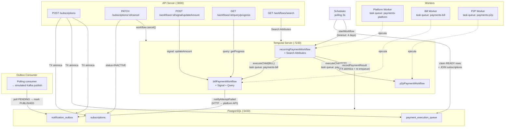
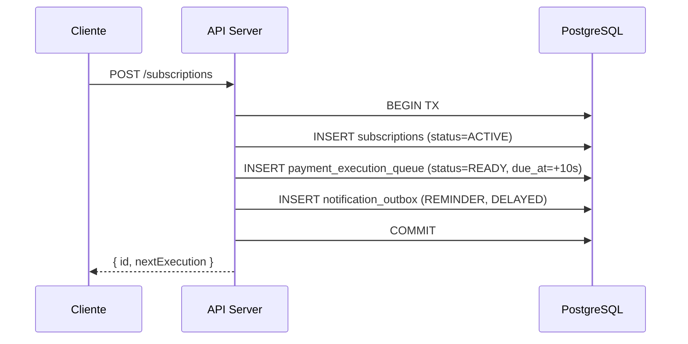
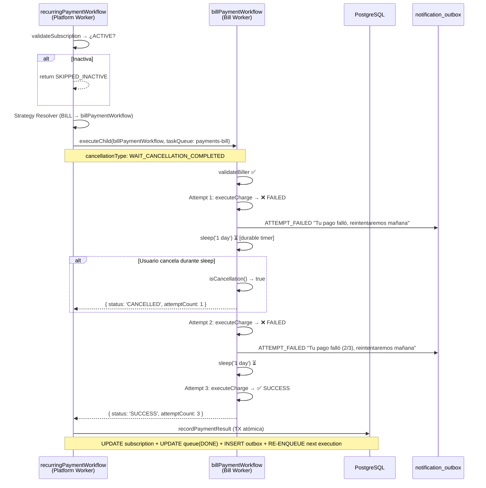
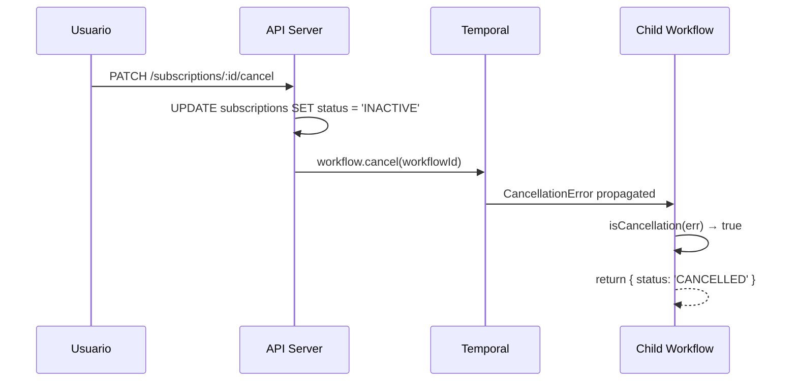
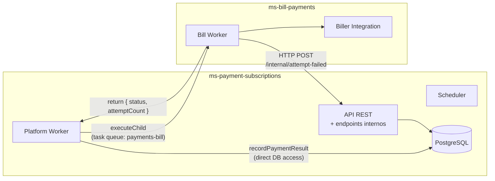

# PoC — PAD 213: Generalized Recurring Payments with Temporal

Proof of Concept que valida la arquitectura de pagos recurrentes automatizados usando **Temporal** como orquestador de workflows.

### ¿Qué problema resuelve?

En Yape tenemos múltiples tipos de pagos recurrentes (servicios, P2P, top-ups) que hoy se ejecutan con cron jobs aislados. Esta PoC valida una **arquitectura unificada** que:

- Orquesta pagos con reintentos durables (sobreviven crashes)
- Escala cada tipo de pago de forma independiente
- Notifica al usuario en cada fallo intermedio
- Permite cancelar un cobro en curso inmediatamente
- Re-encola la siguiente ejecución de forma atómica

**Audiencia:** Equipo de desarrollo de Yape — para validar patrones antes de implementar en producción.

## Tabla de Contenidos

- [Arquitectura General](#arquitectura-general)
- [Flujo de Ejecución Detallado](#flujo-de-ejecución-detallado)
- [Patrones Arquitectónicos Validados](#patrones-arquitectónicos-validados)
- [Quick Start](#quick-start)
- [Verificar que Funciona](#verificar-que-funciona)
- [API — Endpoints y Curls](#api--endpoints-y-curls)
- [Estructura del Proyecto](#estructura-del-proyecto)
- [Modelo de Datos](#modelo-de-datos)
- [Configuración](#configuración)
- [Signals, Queries y Search Attributes](#signals-queries-y-search-attributes)
- [Outbox Consumer](#outbox-consumer)
- [Comunicación entre Servicios](#comunicación-entre-servicios)
- [Notas de Producción vs PoC](#notas-de-producción-vs-poc)
- [Decisiones Arquitectónicas Abiertas](#decisiones-arquitectónicas-abiertas)
- [Troubleshooting](#troubleshooting)

---

## Arquitectura General



---

## Flujo de Ejecución Detallado

### 1. Creación de Subscription (API)



### 2. Scheduler → Temporal

El scheduler hace polling cada 3 segundos buscando ejecuciones pendientes:

```sql
-- Claim rows atómicamente (JOIN con subscriptions para datos reales)
UPDATE payment_execution_queue
SET status = 'PROCESSING', locked_at = now(), locked_by = 'scheduler-1'
WHERE id IN (
  SELECT id FROM payment_execution_queue
  WHERE status = 'READY' AND due_at <= now()
  LIMIT 10
)
RETURNING *;

-- Luego: SELECT destination_id, amount, max_retries FROM subscriptions WHERE id = ANY(...)
```

Por cada row, inicia un `recurringPaymentWorkflow` en Temporal con:
- **Workflow ID determinístico** (`recurring-{sub_id}-{date}`) → evita duplicados
- **Datos reales** de la subscription (amount, destinationId, maxRetries)
- **Execution timeout** de 4 días (3 retries × 1 día + buffer)

El scheduler también ejecuta **recovery automático**: si hay rows en PROCESSING por más de 5 minutos (scheduler crash), las libera a READY.

### 3. Parent Workflow → Child Workflow (con reintentos y cancelación)



### 4. Re-encolamiento (Truly Recurring)

Cuando un pago es exitoso, `recordPaymentResult` ejecuta en una **TX atómica**:
1. Avanza `next_execution_at` (+1 día)
2. Reset `retry_count = 0`
3. Marca queue actual como DONE
4. **Inserta nuevo row en queue** (READY, due_at = next_execution_at)
5. Escribe PAYMENT_SUCCEEDED en outbox

Esto garantiza que la subscription se ejecute indefinidamente hasta que sea cancelada.

### 5. Cuatro resultados posibles del workflow

| Resultado | Descripción | Efecto en BD |
|-----------|-------------|--------------|
| `SUCCESS` | Cobro exitoso (en cualquier intento) | queue→DONE, outbox→PAYMENT_SUCCEEDED, **re-enqueue next day** |
| `FAILED` | Agotó todos los reintentos (max_retries) | queue→FAILED, outbox→PAYMENT_FAILED, **scheduleRetry** |
| `CANCELLED` | Usuario canceló durante un retry sleep | queue→FAILED (vía parent), status→INACTIVE |
| `SKIPPED_INACTIVE` | Subscription ya estaba inactiva | Sin cambios en BD |

### 6. Suspensión por reintentos agotados

Cuando el child workflow agota todos los intentos y el parent llama `scheduleRetry`:
- Si `retry_count + 1 >= max_retries` → **SUSPENDE** la subscription (status=SUSPENDED)
- Si no → incrementa `retry_count` (el próximo ciclo puede reintentar)

### 7. Cancelación en vuelo



El `sleep()` de Temporal es **cancellation-aware**: cuando se cancela el workflow, el timer se interrumpe inmediatamente y el child retorna `CANCELLED`.

---

## Patrones Arquitectónicos Validados

| Patrón | Implementación |
|--------|---------------|
| **Strategy Pattern** | El parent workflow resuelve `subscription_type` → child workflow + task queue |
| **Transactional Outbox** | Notificaciones se escriben en la misma TX que el resultado del pago |
| **Idempotency** | Workflow IDs determinísticos (`{sub_id}-{date}-{type}`) evitan duplicados |
| **Durable Timers** | `sleep('1 day')` en Temporal sobrevive crashes y reinicios |
| **Separation of Concerns** | Task queues separadas por dominio (platform / bill / p2p) |
| **Retry con notificación** | Cada fallo intermedio notifica al usuario vía outbox antes del retry |
| **Re-encolamiento atómico** | Próxima ejecución se inserta en la misma TX que el resultado |
| **Cancellation-aware** | Child workflow detecta cancelación con `isCancellation()` y termina limpiamente |
| **Configurable retries** | `max_retries` se lee de BD, no hardcodeado en el workflow |
| **Signals** | `updateAmount` permite cambiar el monto de cobro mientras el workflow está en retry-sleep |
| **Queries** | `getProgress` inspecciona el estado del child sin bloquearlo (attempt, amount, status) |
| **Search Attributes** | `userId` + `subscriptionType` permiten buscar workflows en Temporal UI/API |
| **Outbox Consumer** | Polling → publicación simulada a Kafka con routing por event_type |
| **Multi-strategy children** | BILL (cobro a biller) y P2P (transferencia wallet-to-wallet) como workflows separados |
| **Scheduler recovery** | Rows stuck en PROCESSING >5 min se liberan automáticamente |
| **Workflow timeout** | `workflowExecutionTimeout: '4 days'` previene workflows zombie |
| **Suspension** | Subscription se suspende tras agotar max_retries definitivamente |

---

## Prerequisitos

- **Docker** (para PostgreSQL)
- **Node.js 18+**
- **Temporal CLI** (`brew install temporal`)

---

## Quick Start

```bash
# 1. Instalar dependencias
npm install

# 2. Levantar PostgreSQL
docker-compose up -d

# 3. Levantar Temporal (en una terminal separada)
temporal server start-dev --ui-port 8233 --db-filename temporal_poc.db

# 4. Crear schema de BD
npm run db:setup

# 5. Registrar Search Attributes en Temporal
chmod +x scripts/register-search-attributes.sh
./scripts/register-search-attributes.sh

# 6. Levantar workers y servicios (cada uno en una terminal)
npm run start:worker:platform   # Terminal 1 — Platform Worker (task queue: payments-platform)
npm run start:worker:bill       # Terminal 2 — Bill Worker (task queue: payments-bill)
npm run start:worker:p2p        # Terminal 3 — P2P Worker (task queue: payments-p2p)
npm run start:scheduler         # Terminal 4 — Scheduler (polling)
npm run start:api               # Terminal 5 — API REST
npm run start:outbox            # Terminal 6 — Outbox Consumer

# 7. Crear subscripciones de prueba
npm run test:create
```

---

## Verificar que Funciona

### Flujo 1: Happy Path (cobro exitoso + re-enqueue)

```bash
# Crear subscription BILL
curl -s -X POST http://localhost:3000/subscriptions \
  -H "Content-Type: application/json" \
  -d '{"userId":"user-001","subscriptionType":"BILL","destinationId":"biller-claro","amount":89.90}' | jq .

# Esperar 15 segundos y verificar resultado
sleep 15

# ¿Se cobró? Debe mostrar PAYMENT_SUCCEEDED
curl -s http://localhost:3000/outbox | jq '.[] | select(.event_type | contains("PAYMENT")) | {event_type, subscription_id}'

# ¿Se re-encoló para mañana? Debe mostrar un row READY con due_at de mañana
curl -s http://localhost:3000/queue | jq '.[] | {status, due_at}' | head -10
```

**Qué esperar:**
- En la terminal del Bill Worker: `[BillPayment] Attempt 1/3 → SUCCESS ✅`
- En la terminal del Outbox Consumer: `📤 [PAYMENT_SUCCEEDED] → kafka://payments.events`
- Si falló el primer intento (20% probabilidad): verás `ATTEMPT_FAILED` + sleep 1 min + reintento

---

### Flujo 2: P2P (transferencia wallet-to-wallet)

```bash
# Crear subscription P2P
curl -s -X POST http://localhost:3000/subscriptions \
  -H "Content-Type: application/json" \
  -d '{"userId":"user-002","subscriptionType":"P2P","destinationId":"wallet-mama","amount":200.00}' | jq .

sleep 15

# Verificar — debe aparecer en el P2P Worker (no en el Bill Worker)
curl -s http://localhost:3000/outbox | jq '.[-1] | {event_type, subscription_id}'
```

**Qué esperar:**
- Terminal P2P Worker: `[P2P] validateP2PRecipient → ACTIVE` + `executeP2PTransfer → SUCCESS`
- Terminal Bill Worker: **nada** (confirma que task queues están aisladas)

---

### Flujo 3: Cancelar mid-flight

```bash
# Crear subscription
SUB_ID=$(curl -s -X POST http://localhost:3000/subscriptions \
  -H "Content-Type: application/json" \
  -d '{"subscriptionType":"BILL","destinationId":"biller-test","amount":100}' | jq -r '.id')

echo "Subscription: $SUB_ID"

# Esperar a que arranque el workflow (12 seg)
sleep 12

# Cancelar
curl -s -X PATCH "http://localhost:3000/subscriptions/$SUB_ID/cancel" | jq .
```

**Qué esperar:**
- Si el workflow estaba en retry-sleep: Bill Worker muestra `🚫 Cancelled during attempt X`
- Si ya había terminado: responde "No active workflow to cancel" (idempotente)

---

### Flujo 4: Signal + Query (cambiar monto y consultar estado)

```bash
# Crear varias subscriptions (alguna fallará y entrará en retry-sleep)
for i in 1 2 3 4 5; do
  curl -s -X POST http://localhost:3000/subscriptions \
    -H "Content-Type: application/json" \
    -d "{\"userId\":\"user-signal\",\"subscriptionType\":\"BILL\",\"destinationId\":\"biller-$i\",\"amount\":$((i*20))}" > /dev/null
done
echo "Creadas 5 subscriptions"

sleep 15

# Buscar un workflow que esté en retry (Running)
curl -s "http://localhost:3000/workflows/search?status=Running" | jq '.workflows[0].workflowId'

# Si hay uno corriendo, usa su ID para:
# Query: ver en qué intento va
curl -s "http://localhost:3000/workflows/{WORKFLOW_ID}/query/progress" | jq .

# Signal: cambiar el monto a 1.00
curl -s -X POST "http://localhost:3000/workflows/{WORKFLOW_ID}/signal/updateAmount" \
  -H "Content-Type: application/json" \
  -d '{"amount": 1.00}' | jq .

# Query de nuevo: confirmar que cambió
curl -s "http://localhost:3000/workflows/{WORKFLOW_ID}/query/progress" | jq .
```

**Qué esperar:**
- Query muestra: `{ currentAttempt: 1, maxAttempts: 3, currentAmount: 50, status: "WAITING_RETRY" }`
- Después del signal: `currentAmount` cambia a `1.00`
- Cuando el timer expire, el Bill Worker cobrará con el nuevo monto

---

### Flujo 5: Search Attributes

```bash
# Buscar todos los workflows de un usuario
curl -s "http://localhost:3000/workflows/search?userId=user-001" | jq '.count, .workflows[].workflowId'

# Buscar por tipo
curl -s "http://localhost:3000/workflows/search?subscriptionType=P2P" | jq '.count'

# También desde Temporal CLI:
temporal workflow list -q 'userId="user-001"'
temporal workflow list -q 'subscriptionType="P2P" AND ExecutionStatus="Running"'
```

---

### Temporal UI

Abre http://localhost:8233 para ver:
- Historial completo de cada workflow (activities, timers, signals)
- Child workflows y su relación con el parent
- Search Attributes como filtros
- Workflows cancelados vs completados

---

---

## API — Endpoints y Curls

### Crear una subscription

```bash
curl -X POST http://localhost:3000/subscriptions \
  -H "Content-Type: application/json" \
  -d '{
    "userId": "user-001",
    "subscriptionType": "BILL",
    "destinationId": "biller-electricity",
    "amount": 120.50,
    "frequency": "DAILY"
  }'
```

Respuesta:
```json
{
  "id": "43a05e07-a7cc-4f5a-b774-fb512457a14b",
  "nextExecution": "2026-07-08T19:28:39.546Z"
}
```

### Cancelar una subscription

```bash
curl -X PATCH http://localhost:3000/subscriptions/43a05e07-a7cc-4f5a-b774-fb512457a14b/cancel
```

Respuesta:
```json
{
  "id": "43a05e07-a7cc-4f5a-b774-fb512457a14b",
  "status": "INACTIVE",
  "message": "Subscription cancelled"
}
```

> **Nota:** Si hay un workflow en ejecución (ej: en sleep de retry), se cancela inmediatamente vía Temporal.

### Listar subscripciones

```bash
curl http://localhost:3000/subscriptions | jq
```

### Ver cola de ejecución

```bash
curl http://localhost:3000/queue | jq
```

### Ver outbox de notificaciones

```bash
curl http://localhost:3000/outbox | jq
```

### Crear subscription P2P (transferencia entre wallets)

```bash
curl -X POST http://localhost:3000/subscriptions \
  -H "Content-Type: application/json" \
  -d '{
    "userId": "user-002",
    "subscriptionType": "P2P",
    "destinationId": "wallet-mama",
    "amount": 200.00,
    "frequency": "DAILY"
  }'
```

### Signal: Cambiar monto mid-flight

Cuando un workflow está en retry-sleep, puedes cambiar el monto que usará en el próximo intento:

```bash
# El workflowId del child es: {subscriptionId}-{date}-BILL
curl -X POST http://localhost:3000/workflows/{subscriptionId}-2026-07-08-BILL/signal/updateAmount \
  -H "Content-Type: application/json" \
  -d '{"amount": 75.00}'
```

### Query: Inspeccionar progreso del child workflow

```bash
# Ver en qué intento va, monto actual, y si está esperando retry
curl http://localhost:3000/workflows/{subscriptionId}-2026-07-08-BILL/query/progress | jq
```

Respuesta:
```json
{
  "currentAttempt": 2,
  "maxAttempts": 3,
  "currentAmount": 75.00,
  "status": "WAITING_RETRY",
  "lastAttemptResult": "FAILED"
}
```

### Query: Estado del parent workflow

```bash
curl http://localhost:3000/workflows/recurring-{subscriptionId}-2026-07-08/query/status | jq
```

### Search: Buscar workflows por atributos

```bash
# Buscar todos los workflows de un usuario
curl "http://localhost:3000/workflows/search?userId=user-001" | jq

# Buscar por tipo de pago
curl "http://localhost:3000/workflows/search?subscriptionType=P2P" | jq

# Buscar por estado
curl "http://localhost:3000/workflows/search?status=Running" | jq

# También funciona directamente con Temporal CLI:
temporal workflow list -q 'userId="user-001" AND subscriptionType="BILL"'
```


## Estructura del Proyecto

```
src/
├── api/
│   └── server.ts              # Express API — CRUD + cancel + signals + queries + search
├── activities/
│   └── index.ts               # Activities: validateSubscription, recordPaymentResult,
│                              #   scheduleRetry, notifyAttemptFailed, validateBiller,
│                              #   executeCharge, validateP2PRecipient, executeP2PTransfer
├── db/
│   ├── pool.ts                # Conexión a PostgreSQL
│   ├── schema.sql             # DDL: subscriptions, payment_execution_queue, notification_outbox
│   └── setup.ts               # Script para crear el schema
├── outbox/
│   └── consumer.ts            # Outbox consumer — polling + simulated Kafka publish
├── scheduler/
│   └── dispatcher.ts          # Poller: claim queue rows → start workflows + recovery
├── scripts/
│   └── create-subscription.ts # Script para crear subscripciones de prueba
├── workers/
│   ├── platform.worker.ts     # Worker: task queue 'payments-platform'
│   ├── bill.worker.ts         # Worker: task queue 'payments-bill'
│   └── p2p.worker.ts          # Worker: task queue 'payments-p2p'
└── workflows/
    ├── index.ts               # Exports de workflows
    ├── recurring-payment.workflow.ts  # Parent: validate → strategy → child → record
    │                                  #   + Search Attributes + Query: getExecutionStatus
    ├── bill-payment.workflow.ts       # Child BILL: charge con retries + Signal + Query
    └── p2p-payment.workflow.ts        # Child P2P: wallet transfer con retries + cancellation
scripts/
└── register-search-attributes.sh    # Registra userId/subscriptionType en Temporal
```

---

## Modelo de Datos

### `subscriptions`
Estado de la suscripción recurrente del usuario.

| Campo | Tipo | Descripción |
|-------|------|-------------|
| id | UUID | PK |
| user_id | TEXT | Usuario dueño |
| subscription_type | TEXT | BILL, P2P, etc. (determina el child workflow) |
| status | TEXT | ACTIVE / INACTIVE / SUSPENDED |
| destination_id | TEXT | Identificador del biller |
| amount | NUMERIC | Monto a cobrar |
| next_execution_at | TIMESTAMPTZ | Próxima ejecución programada |
| retry_count | INT | Reintentos acumulados (se resetea en SUCCESS) |
| max_retries | INT | Máximo de reintentos antes de SUSPENDED (default: 3) |

### `payment_execution_queue`
Cola de ejecuciones pendientes. El scheduler consume de aquí.

| Campo | Tipo | Descripción |
|-------|------|-------------|
| id | UUID | PK |
| subscription_id | UUID | FK → subscriptions |
| status | TEXT | READY → PROCESSING → DONE/FAILED |
| due_at | TIMESTAMPTZ | Cuándo debe ejecutarse |
| workflow_id | TEXT | ID del workflow en Temporal |
| locked_at | TIMESTAMPTZ | Timestamp del lock (para recovery >5min) |
| locked_by | TEXT | Scheduler que lo reclamó |

### `notification_outbox`
Transactional outbox para notificaciones al usuario.

| Campo | Tipo | Descripción |
|-------|------|-------------|
| id | UUID | PK |
| subscription_id | UUID | FK → subscriptions |
| event_type | TEXT | ATTEMPT_FAILED, PAYMENT_SUCCEEDED, PAYMENT_FAILED, REMINDER |
| delivery_class | TEXT | IMMEDIATE / DELAYED |
| payload | JSONB | Datos del evento (incluye attemptCount) |
| idempotency_key | TEXT | UNIQUE — evita duplicados |
| status | TEXT | PENDING → PUBLISHED |

---

## Configuración

| Servicio | Puerto | Notas |
|----------|--------|-------|
| PostgreSQL | 5433 | user: `poc`, password: `poc123`, db: `poc_recurring` |
| Temporal gRPC | 7233 | Servidor Temporal |
| Temporal UI | 8233 | http://localhost:8233 |
| API REST | 3000 | http://localhost:3000 |

---

## Notas de Producción vs PoC

| Aspecto | PoC | Producción |
|---------|-----|-----------|
| Retry delay | 1 minuto | 1 día |
| executeCharge | Simulado (80% éxito) | Integración real con biller |
| Scheduler | Polling simple + recovery | SKIP LOCKED + múltiples instancias + partitioning |
| Outbox consumer | No implementado | Kafka/SQS consumer que publica eventos |
| Auth | Sin autenticación | JWT / API Gateway |
| Observabilidad | Console.log | OpenTelemetry + Datadog |
| Cancelación | Via workflow ID del día | Via Search Attributes (buscar workflows activos por sub_id) |
| max_retries | Configurable por subscription | Configurable por tipo + overrides por usuario |
| Servicios | Monolito (todo en un proceso) | Microservicios separados por dominio |
| Outbox consumer | Polling + console.log | CDC/Debezium → Kafka → N consumers |
| Signals | Via API REST endpoint | Via Temporal client SDK directo |
| Search Attributes | userId, subscriptionType | + customerId, billerId, amount range, region |

---

## Signals, Queries y Search Attributes

### Signals — Modificar workflows en ejecución

Los **Signals** permiten enviar datos a un workflow que está corriendo. El workflow los procesa de forma asíncrona:


**Caso de uso:** El usuario reporta que su factura cambió. Soporte ajusta el monto sin cancelar/recrear la subscription.

### Queries — Inspeccionar workflows sin modificarlos

Los **Queries** son lecturas sincrónicas del estado interno del workflow:

```bash
# ¿En qué intento va? ¿Cuánto va a cobrar?
curl http://localhost:3000/workflows/{wfId}/query/progress
# → { "currentAttempt": 2, "maxAttempts": 3, "currentAmount": 75, "status": "WAITING_RETRY" }
```

**Caso de uso:** Dashboard de ops muestra estado real-time de cada cobro sin consultar la BD.

### Search Attributes — Buscar workflows masivamente

Cada workflow publica `userId` y `subscriptionType` como Search Attributes indexados:

```bash
# "Dame todos los workflows activos del usuario X"
temporal workflow list -q 'userId="user-001" AND ExecutionStatus="Running"'

# "¿Cuántos cobros P2P se ejecutaron hoy?"
temporal workflow list -q 'subscriptionType="P2P" AND StartTime > "2026-07-08"'
```

**Caso de uso:** Soporte busca "todos los pagos del usuario 12345" sin escanear la BD.

---

## Outbox Consumer

El outbox consumer cierra el ciclo de eventos. Hace polling a `notification_outbox` y simula la publicación a Kafka:

```bash
npm run start:outbox
```

Output:
```
📬 Outbox Consumer started — polling every 2s
  📤 [PAYMENT_SUCCEEDED] → kafka://payments.events → [ms-notifications (push), ms-analytics (metrics)]
     subscription: df386204-8059-...
     payload: {"result":"SUCCESS","attemptCount":1}
     idempotency_key: df386204-...-PAYMENT_SUCCEEDED

  📤 [ATTEMPT_FAILED] → kafka://payments.retries → [ms-notifications (push: "reintentaremos mañana")]
     subscription: 63846306-702b-...
     payload: {"attempt":1,"maxAttempts":3,"nextRetryIn":"1 day"}
```

### Routing por event_type

| Event Type | Kafka Topic | Consumers |
|-----------|-------------|-----------|
| `PAYMENT_SUCCEEDED` | `payments.events` | ms-notifications (push), ms-analytics |
| `PAYMENT_FAILED` | `payments.events` | ms-notifications (push+email), ms-support (alert) |
| `ATTEMPT_FAILED` | `payments.retries` | ms-notifications (push: "reintentaremos mañana") |
| `SUBSCRIPTION_SUSPENDED` | `subscriptions.lifecycle` | ms-notifications (email), ms-crm (churn risk) |

---

## Comunicación entre Servicios

En producción, el **child workflow** vive en un servicio diferente al platform. La regla es:

> **Solo el servicio dueño de la BD escribe en ella.** Los child workflows usan la API interna del platform para efectos colaterales.



### Endpoints internos (`/internal/*`)

Estos endpoints son llamados por los child workflows en otros servicios:

| Método | Endpoint | Propósito |
|--------|----------|-----------|
| POST | `/internal/attempt-failed` | Notificar un intento fallido (escribe a outbox) |

```bash
# Ejemplo: child workflow notifica un fallo
curl -X POST http://ms-payment-subscriptions/internal/attempt-failed \
  -H "Content-Type: application/json" \
  -d '{
    "subscriptionId": "43a05e07-...",
    "attempt": 1,
    "maxAttempts": 3,
    "nextRetryIn": "1 day"
  }'
```

### Responsabilidades por servicio

| Servicio | Responsabilidad | Acceso a BD |
|----------|----------------|-------------|
| **ms-payment-subscriptions** | Orquestación, scheduling, state management, outbox | ✅ Directo |
| **ms-bill-payments** | Validar biller, ejecutar cobro, notificar fallos via API | ❌ Solo via HTTP |
| **ms-p2p-payments** (futuro) | Ejecutar transferencia P2P | ❌ Solo via HTTP |

### ¿Por qué este patrón?

1. **Ownership de datos** — Solo un servicio modifica su BD (evita distributed transactions)
2. **Contrato explícito** — Los endpoints internos definen qué puede hacer un child
3. **Independencia de deploy** — El child no necesita conocer el schema de la BD
4. **Testability** — En tests del child, mockeas HTTP; no necesitas BD del platform

---

## Decisiones Arquitectónicas Abiertas

### 1. ¿Un workflow por ejecución o un workflow de larga duración?

| Opción | Descripción | Trade-off |
|--------|-------------|-----------|
| **A) Workflow por ejecución** ✅ (esta PoC) | Scheduler encola → Temporal ejecuta → termina | Simple, versionable, visible en BD |
| **B) Workflow de larga duración** | Un `while(true)` con `sleep('1 day')` por subscription | No necesita scheduler, pero difícil de versionar con 500K workflows dormidos |

### 2. ¿Dónde viven los reintentos?

| Opción | Descripción | Recomendación |
|--------|-------------|---------------|
| **A) Sleep en el child workflow** ✅ (esta PoC) | El child maneja N intentos con durable timers | Ideal para BILL (reintentos son parte del ciclo de cobro) |
| **B) Re-enqueue externo** | Child falla → parent marca FAILED → scheduler re-encola para mañana | Ideal para P2P/TopUp (usuario decide si reintenta) |

Se pueden combinar: retry rápido en child (horas) + re-enqueue externo (días).

### 3. ¿Outbox consumer como Temporal worker o Kafka consumer?

| Opción | Descripción | Recomendación |
|--------|-------------|---------------|
| **A) Kafka consumer** ✅ | CDC/polling → Kafka → múltiples consumers (email, push, analytics) | Estándar, desacoplado, replay |
| **B) Temporal worker** | Otro workflow que hace polling a la outbox | Más simple pero acopla dominios |

### 4. ¿Temporal namespace compartido o dedicado?

**Recomendación:** Namespace dedicado `payments-recurring`. Aislamiento de recursos, retención de historial independiente, permisos separados.

### 5. ¿Cómo escala el scheduler?

| Opción | Descripción |
|--------|-------------|
| **A) Proceso standalone + SKIP LOCKED** | Múltiples instancias del scheduler pueden correr en paralelo sin duplicar trabajo |
| **B) Temporal Schedules** | Feature nativo de Temporal para scheduling (evaluar si soporta batching) |
| **C) Kubernetes CronJob** | Familiar, pero menos control |

---

## Troubleshooting

| Problema | Causa | Solución |
|----------|-------|----------|
| Workers muestran `gRPC Unavailable` | Temporal server no está corriendo | Ejecuta `temporal server start-dev --ui-port 8233 --db-filename temporal_poc.db` |
| `ECONNREFUSED :5433` | PostgreSQL no está corriendo | Ejecuta `docker-compose up -d` |
| Scheduler no detecta subscriptions | La `due_at` aún no venció | Espera 10 segundos después de crear la subscription |
| Signal/Query devuelve 404 | El workflow ya terminó | Crea más subscriptions para tener uno en retry-sleep |
| `ALREADY_EXISTS` en scheduler | Workflow ya fue creado para ese día | Correcto — el scheduler lo maneja como idempotente (skip) |
| `WorkflowTaskFailed` (non-determinism) | Cambiaste código de un workflow con ejecuciones activas | Termina los workflows viejos: `temporal workflow terminate --workflow-id X` |
| Outbox consumer no muestra eventos | Los workflows aún no escribieron al outbox | Espera a que un workflow complete (éxito o fallo) |
| P2P workflow no ejecuta | P2P Worker no está corriendo | Levanta `npm run start:worker:p2p` |
